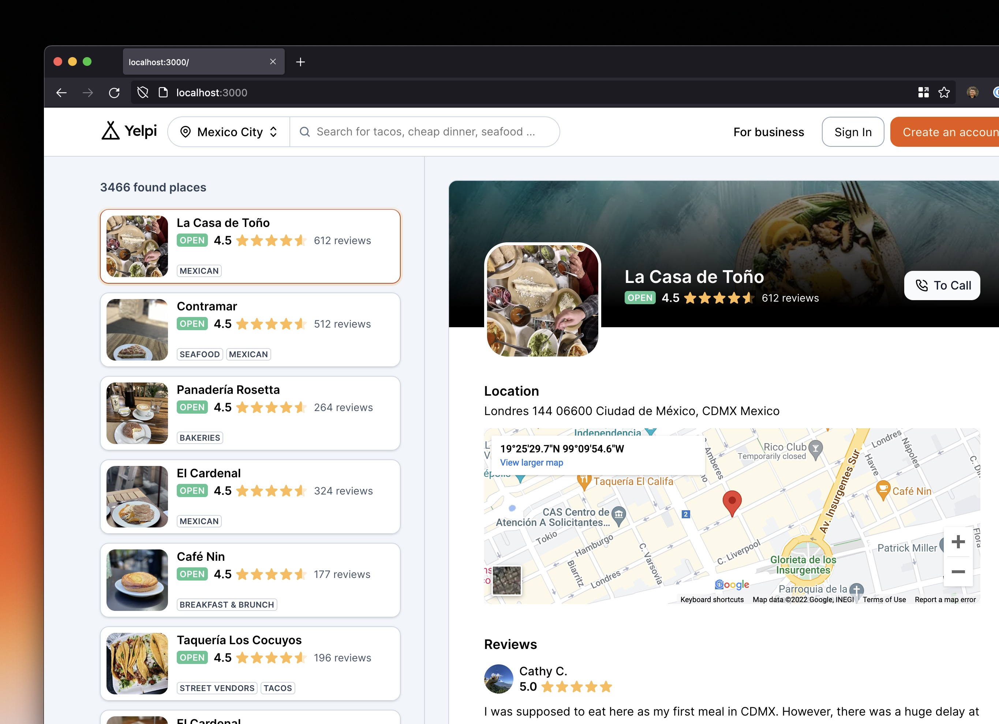

## Yelpi
A website built on `NextJS` to search business from Yelp via GraphQL based on terms and location.



### Getting Started
To get a local copy up and running, please follow these simple steps.

#### Prerequisites
Here is what you need to be able to run the web.
- Node.js (Version: >= 16.x.x < 17).
- Yarn (recommended).
- A free account in Yelp with Developer Beta enabled.

#### Crafted with:
- [Next.js](https://nextjs.org/).
- [React](https://reactjs.org/).
- [Stitches](https://stitches.dev/).
- [SWR](https://swr.vercel.app/).
- [Yelp GraphQL](https://www.yelp.com/developers/graphql/guides/intro).

#### Development
1. Clone the repository.
```sh
git clone https://github.com/coderdiaz/yelpi.git
```

2. Go to project folder.
```sh
cd yelpi
```

3. Copy the `.env.example` and create a new `.env` file.
```sh
cp .env.example .env
```

4. Install dependencies from `package.json`.
```sh
yarn install

# or
npm i
```

5. Start the project.
```sh
yarn dev
```
